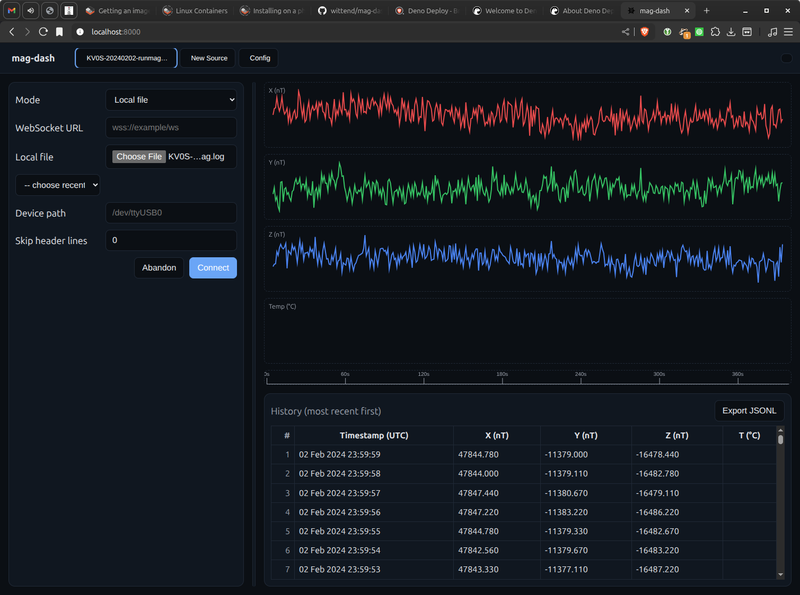

<!--suppress HtmlDeprecatedAttribute -->
<p align="center">
  <!-- img src="docs/Strawman_Magnetometer_Dashboard.jpg" alt="mag-dash screenshot" width="700" / -->
  
</p>

mag-dash
========
A Deno-driven UI dashboard to visualize ground magnetometer time series data, per the requirements in `docs/requirements.md`.

Features
--------

- Single-page web UI served by a tiny Deno HTTP server
- Tabbed interface: create a new data source per tab
- Data source options per tab:
  - WebSocket URL streaming JSON Lines (one JSON object per line)
  - Local file (JSONL); supports skipping header lines
- Local Device (UI option): enter a device path (e.g., /dev/ttyUSB0). Note: direct device access requires either Web Serial or a Deno proxy and can be added on request.
- Live mini-plots (X, Y, Z components) and a scrollable history table (most recent first)
- Light/Dark theme toggle (persists in localStorage)
- Export current tab data to JSONL
- Config tab pinned at the far right for global preferences
- Tabler icons for UI affordances
 - Per-tab splitter position persists across reloads

Vendored assets & offline use
-----------------------------

This app is designed to run fully offline. Tabler Icons webfont assets are vendored into the repo and loaded from local paths only (no CDN fallback).

- Local paths used by the app:

  - `web/vendor/tabler/icons-webfont/3.35.0/tabler-icons.min.css`
  - `web/vendor/tabler/icons-webfont/3.35.0/fonts/tabler-icons.woff2`
  - `web/vendor/tabler/icons-webfont/3.35.0/fonts/tabler-icons.woff`

- The HTML (`web/index.html`) links only to the local vendored CSS to guarantee offline rendering.

Update or fetch vendored icons
  ------------------------------

The repo includes a Deno script to fetch and pin the Tabler Icons webfont assets.

```
deno task vendor:tabler
```

This will download the CSS and font files for version `3.35.0` into `web/vendor/tabler/icons-webfont/3.35.0/` and rewrite the CSS to reference the local files. You can change the version by editing the task in `deno.json` or passing an argument directly:

```
deno run -A scripts/vendor_tabler_icons.ts 3.35.0
```

After running the script, commit the new files under `web/vendor/` so they are available offline and in CI.

 Offline checklist & troubleshooting
 -----------------------------------
 - Hard‑reload offline (Empty cache + hard reload) should render the full UI with icons.
 - DevTools → Network should show 200 for:
   - `/web/styles.css` (text/css)
   - `/web/app.js` (text/javascript)
   - `/web/vendor/tabler/icons-webfont/3.35.0/tabler-icons.min.css` (text/css)
   - `/web/vendor/tabler/icons-webfont/3.35.0/fonts/tabler-icons.woff2` (font/woff2)
 - If you see OTS font errors, re‑vendor assets:
   
   ```
   deno task vendor:tabler
   deno task verify:assets
   ```
 
 - If a font URL returns HTML (shows PNGs in preview), the route likely fell back to the SPA. Ensure the path exists and the server serves `.woff2/.woff/.ttf` with the correct content type.

Licensing
---------

Tabler Icons are MIT-licensed. See https://github.com/tabler/tabler-icons. A small README is written alongside the vendored assets with a source and license pointer.

Data schema
-----------

```
{ "ts": "DD Mon YYYY HH:MM:SS", "x": <float>, "y": <float>, "z": <float> }
```

- `ts`: UTC timestamp string (e.g., `26 Oct 2025 14:20:00`)
- `x`, `y`, `z`: numbers in nanoTesla (nT)
- Values are displayed with three decimals.

Quick start
-----------

Prerequisites: Deno 2.x

- Dev server with live reload:

```
deno task dev
```

Open http://localhost:8000

Keyboard shortcuts & UI tips
----------------------------
- Toggle the configuration panel for the active tab: Ctrl/Cmd+Shift+C (also available via the top‑bar button).
- A synchronized time axis (seconds) appears under the charts and stays aligned during resize.
- Clear per‑type history using the small ❌ buttons next to:
  - WebSocket URL, Local file (recent file names), Device path.
  These clear only the selected history and update suggestions immediately.

Project layout
--------------

- `main.ts` — Deno server that serves files from `web/`
- `web/` — front-end SPA assets
  - `index.html` — main document
  - `styles.css` — light/dark themes and layout
  - `app.js` — tabs, data ingestion (WebSocket/File), charts, history, export
- `docs/` — documentation assets
  - `requirements.md` — product requirements
  - `requirements.txt` — Python requirements for building Sphinx docs
  - `source/` — Sphinx project (Furo theme, MyST for Markdown)

Testing
-------

```
deno task test
```

Notes and roadmap
-----------------

- Optional database logging (e.g., PostgreSQL) is not implemented yet; design hooks can be added as needed.
- A passthrough WebSocket endpoint can be added to the Deno server later if CORS restrictions require it.
- Charts are lightweight Canvas-based sparklines; consider upgrading to a charting lib if more features are required.

License
-------

SPDX-License-Identifier: GPL-3.0-or-later
