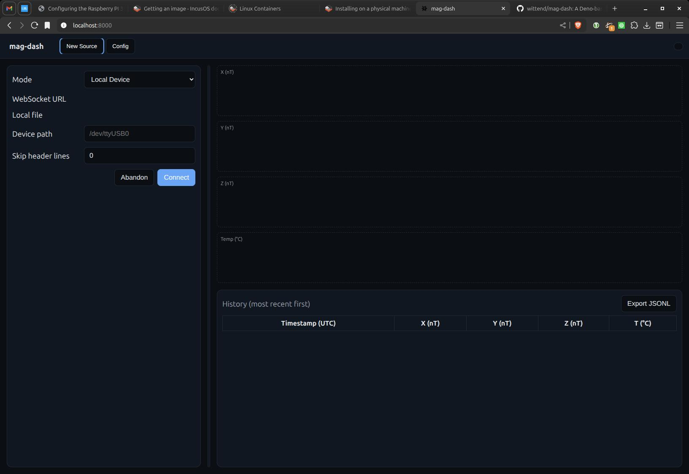

<p align="center">
  
</p>

mag-dash
========
A Deno-driven UI dashboard to visualize ground magnetometer time series data, per the requirements in `docs/requirements.md`.

Features
--------

- Single-page web UI served by a tiny Deno HTTP server
- Tabbed interface: create a new data source per tab
- Data source options per tab:
  - WebSocket URL streaming JSON Lines (one JSON object per line)
  - Local file (JSONL); supports skipping header lines
- Local Device (UI option): enter a device path (e.g., /dev/ttyUSB0). Note: direct device access requires either Web Serial or a Deno proxy and can be added on request.
- Live mini-plots (X, Y, Z components) and a scrollable history table (most recent first)
- Light/Dark theme toggle (persists in localStorage)
- Export current tab data to JSONL
- Config tab pinned at the far right for global preferences
- Tabler icons for UI affordances
 - Per-tab splitter position persists across reloads

Data schema
-----------

```
{ "ts": "DD Mon YYYY HH:MM:SS", "x": <float>, "y": <float>, "z": <float> }
```

- `ts`: UTC timestamp string (e.g., `26 Oct 2025 14:20:00`)
- `x`, `y`, `z`: numbers in nanoTesla (nT)
- Values are displayed with three decimals.

Quick start
-----------

Prerequisites: Deno 2.x

- Dev server with live reload:

```
deno task dev
```

Open http://localhost:8000

Project layout
--------------

- `main.ts` — Deno server that serves files from `web/`
- `web/` — front-end SPA assets
  - `index.html` — main document
  - `styles.css` — light/dark themes and layout
  - `app.js` — tabs, data ingestion (WebSocket/File), charts, history, export
- `docs/` — documentation assets
  - `requirements.md` — product requirements
  - `requirements.txt` — Python requirements for building Sphinx docs
  - `source/` — Sphinx project (Furo theme, MyST for Markdown)

Testing
-------

```
deno task test
```

Notes and roadmap
-----------------

- Optional database logging (e.g., PostgreSQL) is not implemented yet; design hooks can be added as needed.
- A passthrough WebSocket endpoint can be added to the Deno server later if CORS restrictions require it.
- Charts are lightweight Canvas-based sparklines; consider upgrading to a charting lib if more features are required.

License
-------

SPDX-License-Identifier: GPL-3.0-or-later
