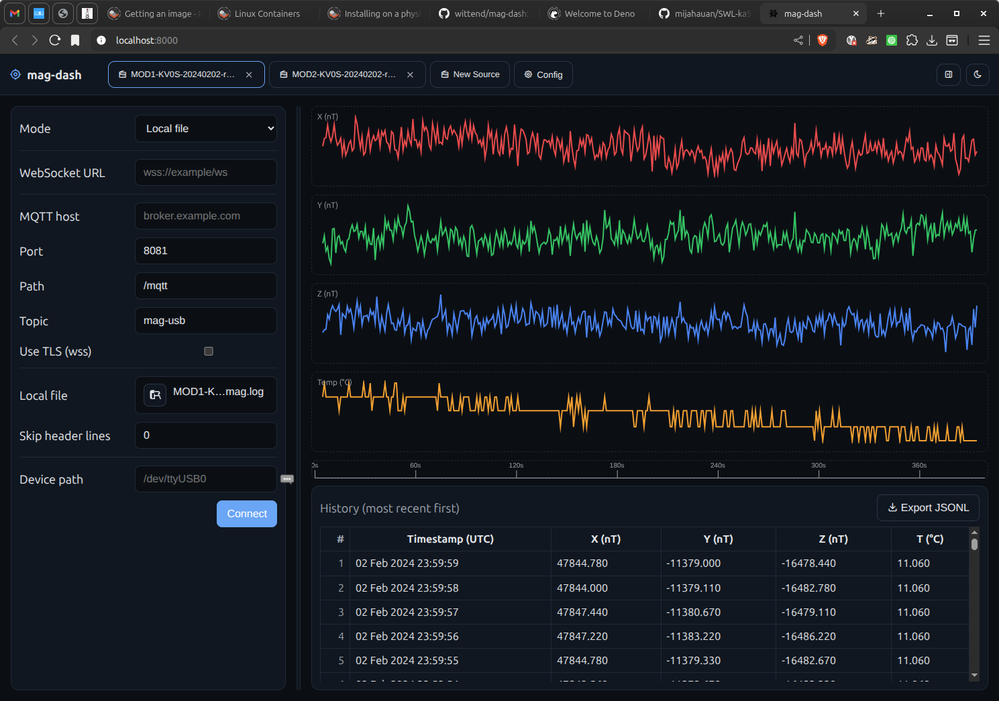
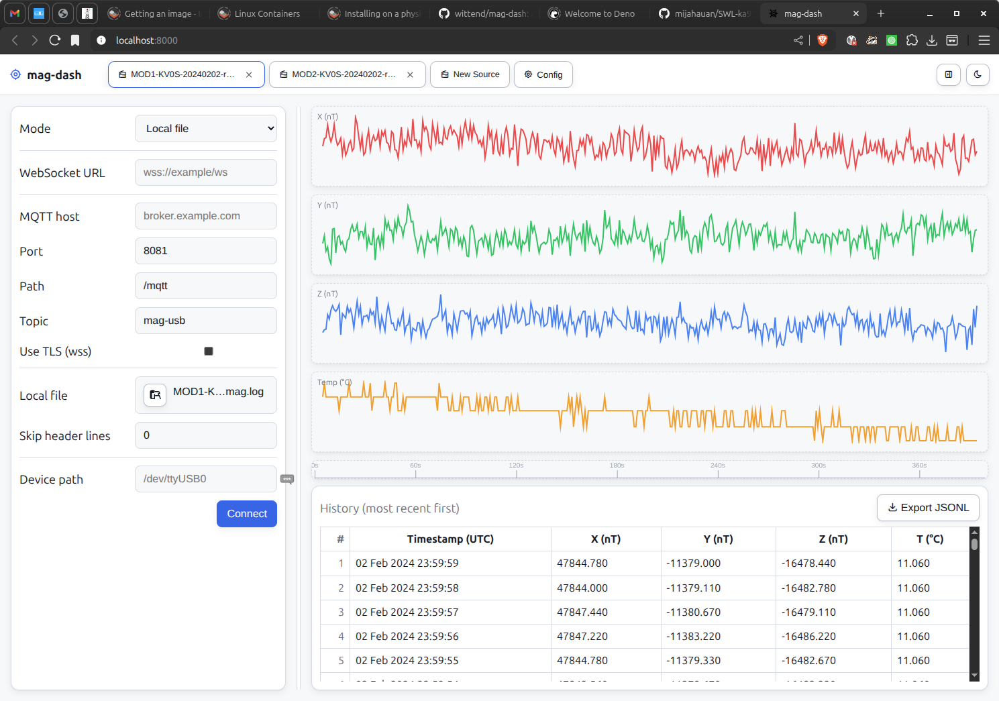

<!--suppress HtmlDeprecatedAttribute -->
<p align="center">
  
</p>
<p align="center">
  
</p>

mag-dash
========

A lightweight Deno‑served single‑page app (SPA) for visualizing ground magnetometer time‑series data. It supports streaming via WebSocket or MQTT-over-WebSocket, as well as local JSONL files, and is designed to work fully offline.

Project docs
------------

- Documentation (Read the Docs): https://mag-dash.readthedocs.io/ (placeholder; configure in RTD)
- Changelog: see `CHANGELOG.md`
- Requirements: see `docs/requirements.md`

Features
--------

- Single-page web UI served by a tiny Deno HTTP server
- Tabbed interface: create a new data source per tab
- Data source options per tab:
  - WebSocket URL streaming JSON Lines (one JSON object per line)
  - Local file (JSONL); supports skipping header lines
- Local Device (UI option): enter a device path (e.g., /dev/ttyUSB0). Note: direct device access requires either Web Serial or a Deno proxy and can be added on request.
- Live mini-plots (X, Y, Z components) and a scrollable history table (most recent first)
- Light/Dark theme toggle (persists in localStorage)
- Export current tab data to JSONL
- Config tab pinned at the far right for global preferences
- Tabler icons for UI affordances
 - Per-tab splitter position persists across reloads

Protocol support and limitations
--------------------------------

- Local File (JSONL)
  - Fully offline. Reads a user‑selected file via the file picker.
- WebSocket streaming (JSON Lines)
  - Cross‑origin WebSockets generally work, but your server may enforce Origin checks.
  - If the page is served over HTTPS, browsers block mixed content; use `wss://` instead of `ws://`.
- MQTT over WebSocket
  - Uses `mqtt.connect(url, { username, password })` provided by the vendored MQTT bundle.
  - Requires a broker that exposes WebSocket (ws/wss) and allows your site’s Origin when internet‑facing.
  - On HTTPS pages, use `wss://` only.

Vendored assets & offline use
-----------------------------

This app is designed to run fully offline. Tabler Icons webfont assets are vendored into the repo and loaded from local paths only (no CDN fallback).

- Local paths used by the app:

  - `web/vendor/tabler/icons-webfont/3.35.0/tabler-icons.min.css`
  - `web/vendor/tabler/icons-webfont/3.35.0/fonts/tabler-icons.woff2`
  - `web/vendor/tabler/icons-webfont/3.35.0/fonts/tabler-icons.woff`

- The HTML (`web/index.html`) links only to the local vendored CSS to guarantee offline rendering.

Strict offline mode (toggle)
---------------------------

To make offline behavior explicit, the UI supports a "strict offline" toggle that prevents any fallback to a CDN for optional libraries (specifically the MQTT client).

When strict offline is enabled, if the local vendored MQTT bundle is missing or unusable, the app will NOT attempt to load from the internet and will instead fail fast with a clear error.

Ways to enable strict offline (first match wins):

- URL query parameter: add `?strict_offline=1` to the page URL, e.g. `http://localhost:8000/?strict_offline=1`
- localStorage flag: `localStorage.setItem('magdash.strict_offline', '1')`
- Global JS flag (before loading the app): `window.MAGDASH_STRICT_OFFLINE = true`

To disable, remove the parameter/flag or set it to `0`/`false`.

Deployment options
------------------

- Local/offline
  - Run the bundled Deno server and access the UI at `http://localhost:8000`.
  - Ensure vendored assets exist (Tabler fonts and `web/vendor/mqtt/mqtt.bundle.mjs`).
  - Optional: enable strict offline to prevent any CDN attempts.
  - Data sources must be local: File, or WebSocket/MQTT endpoints reachable on localhost/LAN.
- Internet‑facing
  - Serve via HTTPS if you need `wss://` data feeds (recommended).
  - Configure your WebSocket/MQTT servers to allow the dashboard’s Origin.
  - Consider authentication and rate limiting at your reverse proxy.

Update or fetch vendored icons
  ------------------------------

The repo includes a Deno script to fetch and pin the Tabler Icons webfont assets.

```
deno task vendor:tabler
```

This will download the CSS and font files for version `3.35.0` into `web/vendor/tabler/icons-webfont/3.35.0/` and rewrite the CSS to reference the local files. You can change the version by editing the task in `deno.json` or passing an argument directly:

```
deno run -A scripts/vendor_tabler_icons.ts 3.35.0
```

After running the script, commit the new files under `web/vendor/` so they are available offline and in CI.

 Offline checklist & troubleshooting
 -----------------------------------
  - Hard‑reload offline (Empty cache + hard reload) should render the full UI with icons.
  - DevTools → Network should show 200 for:
    - `/web/styles.css` (text/css)
    - `/web/app.js` (text/javascript)
    - `/web/vendor/tabler/icons-webfont/3.35.0/tabler-icons.min.css` (text/css)
    - `/web/vendor/tabler/icons-webfont/3.35.0/fonts/tabler-icons.woff2` (font/woff2)
    - `/web/vendor/mqtt/mqtt.bundle.mjs` (text/javascript; only when using the MQTT tab)
  - If you see OTS font errors, re‑vendor assets:
    
    ```
    deno task vendor:tabler
    deno task verify:assets
    ```
 
 - If a font URL returns HTML (shows PNGs in preview), the route likely fell back to the SPA. Ensure the path exists and the server serves `.woff2/.woff/.ttf` with the correct content type.
 - For a defense‑in‑depth offline setup, set a CSP in your reverse proxy to block external scripts while allowing your data connections, e.g.:
   
   ```
   Content-Security-Policy: default-src 'self'; connect-src 'self' ws: wss:
   ```

Open internet checklist
-----------------------

- Serve via HTTPS if connecting to secure data feeds; browsers block mixed content.
- For `https://` pages, use `wss://` WebSockets (including MQTT over WebSocket).
- Configure your WebSocket/MQTT servers to allow the dashboard's Origin.
- Consider adding auth at the reverse proxy if the dashboard shouldn’t be public.

Licensing
---------

mag-dash is licensed under GPL‑3.0‑or‑later; see `LICENSE` for full text.

Third‑party notices:
- Tabler Icons are MIT‑licensed. See https://github.com/tabler/tabler-icons (source and license pointer included alongside vendored assets).
- MQTT bundle is generated from https://esm.sh/mqtt@5 for offline use; see `web/vendor/mqtt/` for details.

Data schema
-----------

```
{ "ts": "DD Mon YYYY HH:MM:SS", "x": <float>, "y": <float>, "z": <float> }
```

- `ts`: UTC timestamp string (e.g., `26 Oct 2025 14:20:00`)
- `x`, `y`, `z`: numbers in nanoTesla (nT)
- Values are displayed with three decimals.

Quick start
-----------

Prerequisites: Deno 2.x

- Dev server with live reload:

```
deno task dev
```

Open http://localhost:8000

Keyboard shortcuts & UI tips
----------------------------
- Toggle the configuration panel for the active tab: Ctrl/Cmd+Shift+C (also available via the top‑bar button).
- A synchronized time axis (seconds) appears under the charts and stays aligned during resize.
- Clear per‑type history using the small ❌ buttons next to:
  - WebSocket URL, Local file (recent file names), Device path.
  These clear only the selected history and update suggestions immediately.

Project layout
--------------

- `main.ts` — Deno server that serves files from `web/`
- `web/` — front-end SPA assets
  - `index.html` — main document
  - `styles.css` — light/dark themes and layout
  - `app.js` — tabs, data ingestion (WebSocket/File), charts, history, export
- `docs/` — documentation assets
  - `requirements.md` — product requirements
  - `requirements.txt` — Python requirements for building Sphinx docs
  - `source/` — Sphinx project (Furo theme, MyST for Markdown)

Testing
-------

```
deno task test
```

Notes and roadmap
-----------------

- Optional database logging (e.g., PostgreSQL) is not implemented yet; design hooks can be added as needed.
- A passthrough WebSocket endpoint can be added to the Deno server later if CORS restrictions require it.
- Charts are lightweight Canvas-based sparklines; consider upgrading to a charting lib if more features are required.

License
-------

SPDX-License-Identifier: GPL-3.0-or-later
